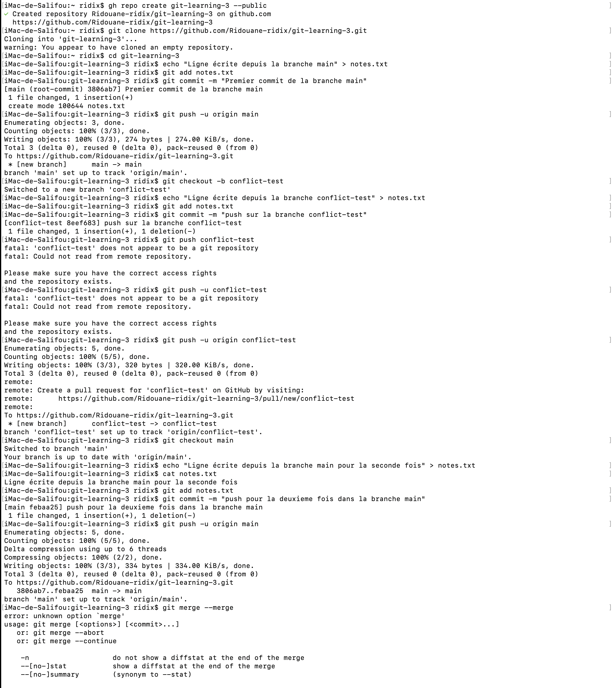

# Exercice3
## les differants commandes Uliliser
### gh repo create git-learning-3 --public
- pour créer un répertoir github depuis le teminal
### git clone https://github.com/Ridouane-ridix/git-learning-3
- pour cloner le repertoire 
### cd git-learning-3
- pour ce deplacer vers le repertoire
### echo "Ligne écrite depuis la branche main" > notes.txt
- pour créer un fichier et mettre le contenus dans le fichier
### git add notes.txt
- pour ajouter le fichier notes.txt
### git commit -m "premier commit de la branche main"
- pour faire un message
### git push -u origin main
- pour push le fichier sur la branch main
## Les images du terminale
### Image-1

### Image-2
