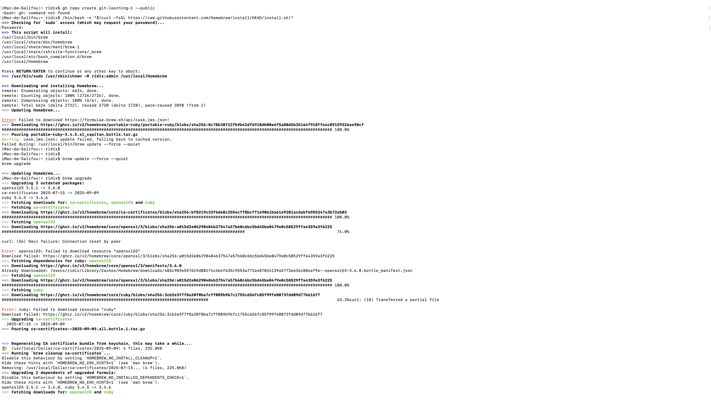
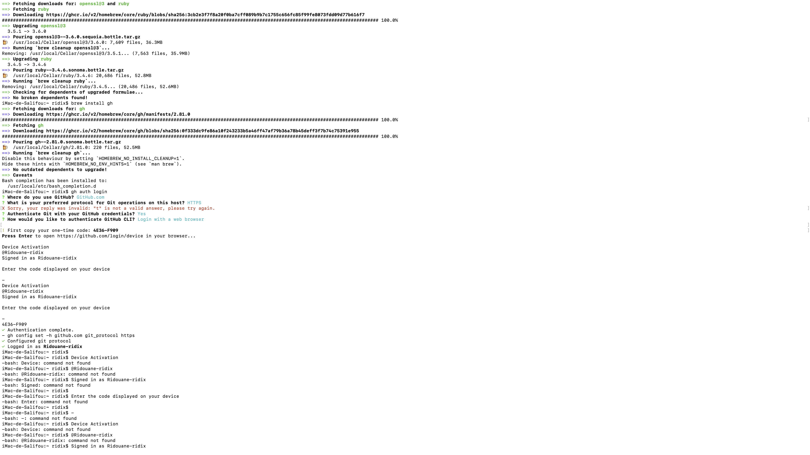
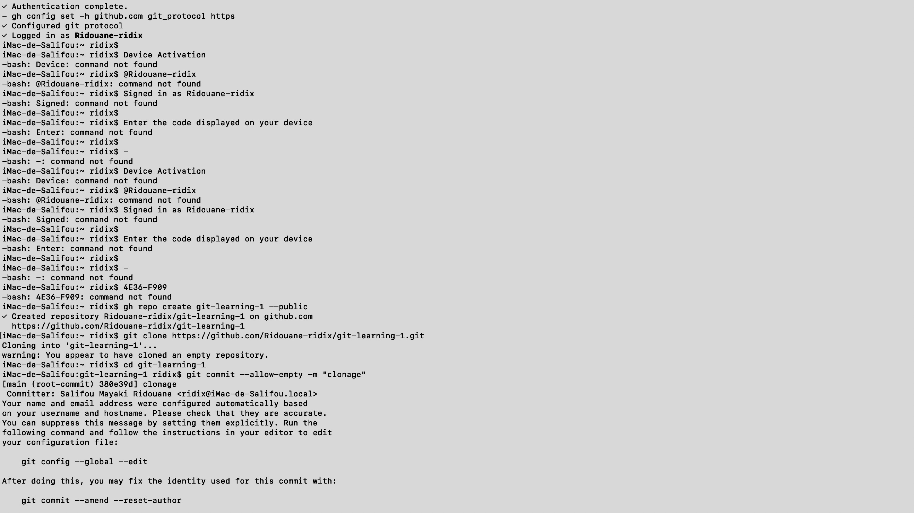
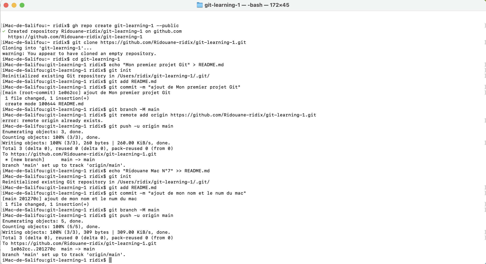

# Exercice1:
## les differants commendes utiliser
### brew install gh: 
- permet dinstaller github-cli
### gh auth login:
- permet de faire l'authentification entre le terminal et la page github
### gh repo create nom du repo --public:
- permet de creét un repertoir github
### git clone https.........:
- permet de cloner mon repertoir localement 
### cd 
- qui permet de ce deplacer
### echo "Mon premier projet Git" > README.md
- qui permet de créer le fichier et mettre le contenue dans le fichier 
### git init
- pour initialiser 
### git add README.md
- pour ajouter le fichier qu'ont veut pucher
### git commit -m "ajout de Mon premier projet Git"
- pour écrire un message
### git branch -M main
- pour créer la branch main
### git remote add origin https://github.com/Ridouane-ridix/git-learning-1.git
- pour ajouter le lien du repo
### git push -u origin main
- pour pucher le ou les fichier sur la branche main
## Les differents images du Terminal
### Image-1

### Image-2

### Image-3

### Image-4
