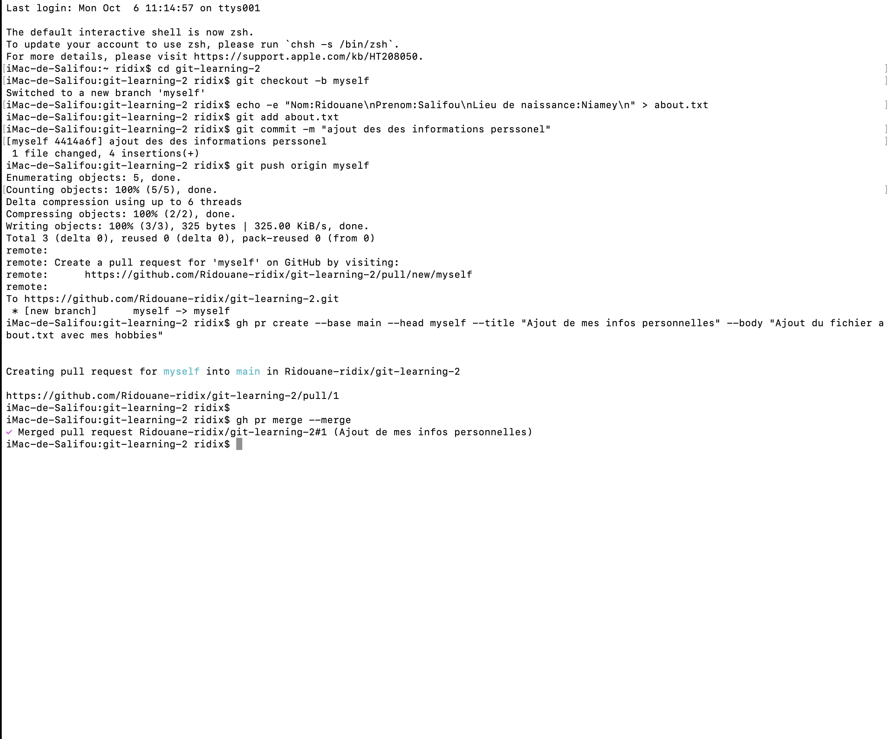

# Exercice2
## Les differents commande utiliser
### cd git-learning-2
- pour me deplacer vers le repertoire 
### git checkout -b myself 
- pour céer et me rendre sur la branche myself
### echo -e "Nom:Ridouane\nPrenom:Salifou\nLieu de naissance:Niamey\n" > about.txt
- pour créer le fichier le mettre le contenue en question 
### git add about.txt
- Pour ajouter le fichier about.txt
### git commit -m "Ajout des des informations personnel"
- pour enregister les modification puis faire un message
### git push origin myself
- pour pucher sur la branch main 
### gh pr create --base main --head myself --title "Ajout de mes infos personnelles" --body "Ajout du fichier about.txt avec mes hobbies" 
- pour créer un pull request
### gh pr merge --merge 
- pour fusionner la pull request
## Les Images utiliser
### Image-1
